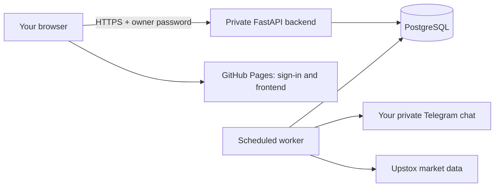

# Live Nifty Signal

For the public-data setup without a broker account, start with [PUBLIC_DATA.md](PUBLIC_DATA.md). Yahoo is now the default provider; Upstox credentials below apply only when selecting `MARKET_DATA_PROVIDER=upstox`.

The frontend can run on GitHub Pages. The API, database, market connection, scheduler and Telegram sender run on an always-on Linux server. Publishing the frontend alone does **not** start those services.



## Required before deployment

1. A Linux VM with SSH access and Docker Compose, plus an API domain pointing to it. The Oracle Mumbai VM in the brief is suitable if already available; provisioning it requires your cloud account and available capacity.
2. An Upstox market-data token. Prefer its [read-only Analytics Token](https://upstox.com/developer/api-documentation/analytics-token/); the provider documents market quotes and historical data access with one-year validity. You generate it in your own account. Other brokers need a separate adapter.
3. A Telegram bot created with [BotFather](https://core.telegram.org/bots/tutorial#obtain-your-bot-token), a private chat ID, and a `/start` message sent by you to that bot.
4. The GitHub repository and its Pages settings. [GitHub Pages](https://docs.github.com/en/pages/getting-started-with-github-pages/what-is-github-pages) serves static files; private-repository availability depends on your GitHub plan. The published frontend is a public sign-in page; all journal data stays behind the authenticated API. Do not change repository visibility to public without reviewing the personal context files.

Put credentials in server `.env.live`, never in chat, Git, frontend files, or `VITE_*` variables.

For the supplied Oracle VM, `deploy/oracle/` contains a lightweight installation using project-local Python/Caddy and SQLite with WAL. This fits the approximately 1 GB VM without running optional ML models. Application code and state live in `/opt/finance-stock-buddy`; systemd manages the API, HTTPS and worker. The local SSH key stays in `.secrets/ssh`, excluded from Git and deployment archives. HTTPS can use the IP with an explicitly configured, automatically renewed Let's Encrypt short-lived certificate if inbound ports 80/443 are reachable.

### Oracle VM status (2026-09-07)

Installed on the VM at 130.210.23.30 (Oracle Linux 9, x86_64, 945 MB RAM plus swap): verified Python 3.13 and Caddy runtimes under `.runtime/`, the locked requirements in `.venv/`, the release bundle from `scripts/package_release.py`, the owner `.env` (Telegram off, Yahoo provider, four public feeds), and a consistent copy of the local `data/public-live.db` as `data/live.db` so the observed history, notes and receipt times carried over. `nifty-api`, `nifty-worker` and `nifty-proxy` are enabled and active; the API answers on loopback port 8000 and serves the built frontend at `/`, so GitHub Pages is optional. Yahoo quotes and the RSS feeds were fetched successfully from the VM. The host firewall allows `http` and `https`.

Telegram was connected on the same night: the bot token and the owner's private chat ID live only in the VM `.env` and the ignored local `.secrets/oracle.env`; `app.live telegram-chats` discovered the chat from the owner's `/start`, `telegram-check` verified bot and chat without sending, and `TELEGRAM_ENABLED=true` was set before restarting the worker. The first message is the scheduled morning note after the first saved calls; nothing was sent during setup.

GitHub Pages went live on 2026-09-08 at https://rsjoshi2912.github.io/finance-stock-buddy/. GitHub refused Pages while the repository was private on the Free plan, so the owner chose to make the repository public; the full history was scanned first and contains only empty example env files. The repository variable `VITE_API_BASE_URL` is `https://130.210.23.30`, Pages uses the Actions source, and the VM's `FRONTEND_ORIGINS` already allowed the github.io origin. The Pages copy is rebuilt on every push to `main` that touches `frontend/`; the VM copy is updated by the redeploy steps below, so the two can differ until both are refreshed.

Incident, 2026-09-08: the first live calls were written at 07:20 IST, but Oracle Linux's `dnf-makecache` job then grew to 650 MB on the 945 MB VM. The box thrashed on swap from about 07:45 to 10:35 IST, the worker's loop crawled, the 08:30 morning note was never attempted (missed windows are not replayed by design), no quotes were saved until 10:35, and the site stalled for the owner. The kernel's OOM killer ended it by killing `dnf`. `dnf-makecache.timer` is now disabled on the VM. Keep the VM free of other heavy processes: run rehearsals and research locally, not beside the API and worker. System health shows "Scheduler: Not running" whenever the heartbeat is stale.

The VCN security list has stateful CIDR ingress rules for TCP 80 and 443 from 0.0.0.0/0 (added by the owner on 2026-09-07). After a proxy restart Caddy obtained a Let's Encrypt short-lived certificate for the IP, and https://130.210.23.30 serves the journal behind the owner password. Caddy renews the short-lived certificate on its own; if it ever stops, `sudo systemctl restart nifty-proxy` forces a fresh attempt. The Caddyfile sets `default_sni 130.210.23.30`: clients send no SNI when connecting to a bare IP, and behind Oracle's NAT the listener's own address is private, so without it Caddy answered every browser with a TLS "internal error" alert even though the certificate had been issued. Redeploy: rebuild `frontend/dist`, run `scripts/package_release.py`, copy the tarball to `/opt/finance-stock-buddy`, extract it there, and `sudo systemctl restart nifty-api nifty-worker`. The database, `.env`, `.venv` and `.runtime` are outside the bundle and survive a redeploy.

For Telegram setup on your Mac, save the BotFather token in the project's ignored `.env`, send `/start` to your bot, and run from `backend`: `../.venv/bin/python -m app.live telegram-chats`. This returns only private chat IDs associated with `/start`, never message bodies, and sends nothing. Set your own ID as `TELEGRAM_CHAT_ID`, then run `../.venv/bin/python -m app.live telegram-check`.

## Server setup

Copy or clone this repository onto the VM. From its root:

```bash
cp deploy/live.env.example .env.live
chmod 600 .env.live
```

Fill in `OWNER_PASSWORD`, `POSTGRES_PASSWORD`, `UPSTOX_ACCESS_TOKEN`, `TELEGRAM_BOT_TOKEN`, `TELEGRAM_CHAT_ID`, `FRONTEND_ORIGINS` and `SITE_DOMAIN`. Use random passwords; generate a hex database password so it does not need URL escaping. `FRONTEND_ORIGINS` is an origin such as `https://rsjoshi2912.github.io`, with **no repository path**. Keep `TELEGRAM_ENABLED=false` during setup.

```bash
docker compose --env-file .env.live up -d --build db api
docker compose --env-file .env.live exec api python -m app.live doctor
```

The database is on the internal Docker network. The API binds to the VM's loopback port 8000. Install Caddy on the VM, configure `deploy/Caddyfile` with your real API domain, and allow inbound 80/443. Caddy terminates HTTPS and forwards to port 8000. Do not expose the database or port 8000 directly. Server setup has **not** been executed by the local build.

## Instruments and history

Prepare a verified universe CSV at `data/universe.csv`:

```csv
symbol,name,sector,kind,member_from,member_to,instrument_key
RELIANCE,Reliance Industries,Energy,stock,YYYY-MM-DD,,NSE_EQ|INE002A01018
```

Replace `YYYY-MM-DD` with the date from which membership is actually established. Get the current constituents from [Nifty Indices](https://www.niftyindices.com/indices/equity/broad-based-indices/nifty-500) and instrument keys from the [Upstox instrument master](https://upstox.com/developer/api-documentation/instruments/). Include NIFTY and BANKNIFTY with their verified index keys. A current list establishes membership only from the observation date; do not pretend it supplies historical membership. Preserve exited names. Membership re-entry support and split/bonus reconciliation remain separate research work.

```bash
docker compose --env-file .env.live cp data/universe.csv api:/srv/app/data/universe.csv
docker compose --env-file .env.live exec api python -m app.live import-universe --file /srv/app/data/universe.csv
docker compose --env-file .env.live exec api python -m app.live bootstrap
docker compose --env-file .env.live exec api python -m app.live quotes
docker compose --env-file .env.live exec api python -m app.live telegram-check
```

Bootstrap retrieves up to 90 calendar days of daily candles for the supplied active universe. Source candle timestamps mark the candle's **start**, not its publication. We conservatively record actual receipt as first-known publication and ingestion. Therefore newly loaded history cannot be used for a forecast with an earlier cutoff. Bootstrap before 07:00 for today's calls, or let forecasting begin on a later session.

`telegram-check` calls `getMe` and `getChat`, verifies the configured private chat, and **sends nothing**. Sending uses the already supplied deterministic morning/evening templates. The owner has requested Telegram integration; enable the worker only once the bot/chat and previews are correct.

## Start the schedule

Set `TELEGRAM_ENABLED=true` in `.env.live` when ready, then:

```bash
docker compose --env-file .env.live up -d api worker
docker compose --env-file .env.live logs --tail=60 worker
```

| India time | Worker behaviour |
| --- | --- |
| 06:00–06:55 | Load prior-session daily history |
| 07:20–08:25 | Write today's calls once using the 07:00 cutoff; exclude stocks missing the prior-session candle |
| 08:30–08:45 | Send the saved morning note once |
| Market session | Request price snapshots every 15 seconds |
| 18:30–19:30 | Poll daily candles and resolve results in 15-minute slots; incomplete results stay pending |
| 19:00–19:15 | Send the evening note once, explicitly listing pending calls when necessary |

The provider's exchange-session API supplies holidays and hours. Unknown hours stop the work. Nonstandard sessions can display quotes but skip this fixed open-to-close daily strategy. Missed morning windows are not replayed later. The scheduler holds a database advisory lock on PostgreSQL (a file lock on SQLite), persists completed jobs, and limits failures to three attempts per slot. A Telegram timeout is treated as uncertain delivery: it never automatically resends that attempted message. Check Telegram before any manual recovery.

The frontend checks saved quotes every 15 seconds. This is **polled market data, not tick-by-tick streaming**; provider timestamps and stale states are shown. Frozen daily calls never change when prices update. Quotes are never used as final closing prices or training outcomes. Weekly ML retraining and LLM agents remain outside this baseline deployment.

For a non-Docker install, `deploy/nifty-signal.service` and `deploy/nifty-worker.service` provide the same API/worker setup. Install only one scheduling method. Disable the old `nifty-predict.timer` if you use the worker.

## GitHub Pages

In repository **Settings → Secrets and variables → Actions → Variables**, create:

```text
VITE_API_BASE_URL=https://your-real-api-domain
```

This is a public URL, not a secret. The workflow rejects a missing URL, plain HTTP, credentials in a URL, or an `/api` suffix. In **Settings → Pages**, choose **GitHub Actions**. Push `main` or manually run “Publish journal frontend”. The workflow publishes only `frontend/dist`; databases, credentials and journal records are excluded.

The site URL will normally be `https://OWNER.github.io/REPOSITORY/`. Relative asset paths and hash navigation support that prefix. Cross-origin API requests use owner authentication and an exact origin allowlist. Credentials remain in browser memory and are cleared on sign-out or refresh. CSV exports use authenticated requests too.

## Verification and operational limits

Local automated tests cover provider errors and secret redaction, timestamp integrity, quote isolation, IST windows, holidays, retry limits, duplicate-send prevention, API authentication and cross-origin access. Actual broker data, actual Telegram delivery, Docker/PostgreSQL startup, DNS/TLS and GitHub deployment require configured external services and must be verified there.

Use System health to inspect worker heartbeat, price timestamps, failed jobs and Telegram configuration. Back up PostgreSQL regularly with `pg_dump`; verify restores before relying on the journal. The baseline trend rule remains uncalibrated. Connecting live services starts an experiment; it does not establish profitability or unlock F&O.

GitHub Actions is used for builds/deployment, not for timing daily calls: its [scheduled workflows can be delayed or dropped](https://docs.github.com/en/actions/reference/workflows-and-actions/events-that-trigger-workflows#schedule).

### Reviewed release (2026-09-08)

Commit `f3de0b7` deploys the event-history review fixes, formatted Telegram notes and Index lab. Both the VM and Pages now include the reviewed frontend. The VM release was verified by SHA-256 before extraction; prior code and an integrity-checked SQLite backup are in `data/backups/before-f3de0b7-*`. No configuration or database was replaced. API, worker and proxy are active. GitHub backend/build checks and Pages publication passed. Message rendering and mock delivery were tested; no Telegram message was sent by this review. See MEMORY.md for the handoff and INDEX_PLAN.md for the limits of the option calculator.
